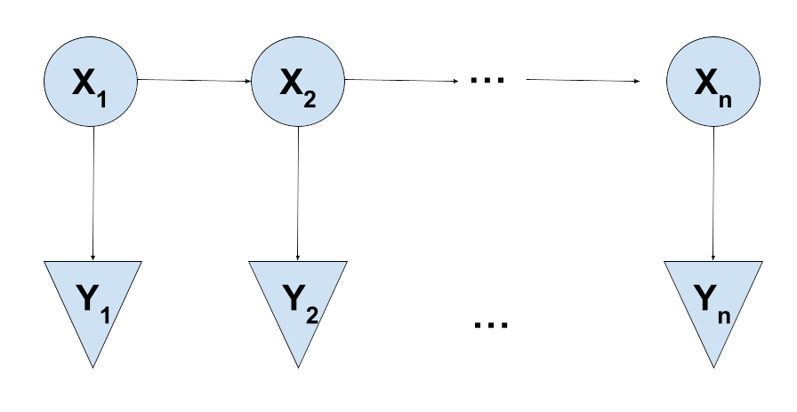

# An Implementation of the Baum-Welch Algorithm

Author: Aidan Clark

Date: 6/27/2024

This is an R implementation of the Baum-Welch algorithm for estimating the parameters of a Hidden Markov Model, assuming normally distributed emissions. I wrote this code as part of a group project for my Computational Statistics class, where my group tested the Baum-Welch algorithm on simulated Hidden Markov Model emissions. One of my tasks for this project was to implement the Baum-Welch algorithm from scratch. You can find the functions I wrote in [this file](BaumWelchAlgo.R). An explanation of the model, the algorithm, and all underlying assumptions is below.

### The Gist

If you're interested in probability-speak, see the two sections below. For a (hopefully) non-technical explanation of the problem this code tries to solve, read further!

Let's say that we have a chain of events where the "state" of each event depends only on the previous event in the chain. As a rough example, let's say our chain of events is "Days in February" and the states we are interested in are "Snow" and "No Snow." The chances of it snowing on February 15th are perhaps different depending on whether or not it snowed on February 14th. We call this chain a Markov Chain.

In a Hidden Markov Model, we do not know the state of the Markov Chain at any given time! That is, the events in the Markov Chain are latent or hidden. Instead, each event in the chain-- in the above example, each day in February -- gives off an "emission." The value of each emission is random, but it depends on the state of the chain at that time. To continue the snow example, let's say that we don't want to look outside to see if it's snowing (We don't want to open the curtains!), but instead we gather only temperature readings each day. We would expect that, on average, days where it snows would be colder than days where it doesn't snow. The state that an event in the chain is in influences the emission values produced.

Of course, a temperature reading like 20 degrees Fahrenheit could very well come from a snowy day or a non-snowy day. We can't be certain, based solely off the emission value, what state the chain was in. Therein lies the problem: given only the emissions-- the temperatures-- how can we reliably predict the state sequence-- snow or no snow-- of the underlying Markov Chain? Moreover, how can we predict the parameters underlying our Hidden Markov Model? These parameters include probabilities, such as the probability that we go from a snowy day to a non-snowy day, and information about our emissions, such as a typical temperature range for snowy days. The Baum-Welch algorithm, using various probability tricks and manipulations, estimates these parameters. Very generally, given a sequence of emissions, the algorithm picks the parameter values that maximize the chances of observing the emission sequence that we did.

I hope that this explanation gives you some intuition about Hidden Markov Models and the problem of estimating their underlying parameters!

### Hidden Markov Models

We first define our version of a Hidden Markov Model (HMM). We assume that we have latent variables $X_1$ through $X_n$ that form a markov chain. That is, for all $t < n$, there is an edge from $X_t$ to $X_{t+1}$. Each $X_t$ can take on any state in the (finite) set $S$. The initial probabilities are given in a $|S|$-length vector I, where the entry $I[i]$ is $P(X_1 = i)$. The state transition probabilities are given in the $|S|$ by $|S|$ matrix $A$, where the entry $A[i,j]$ is $P(X_{t} = i, X_{t+1} = j)$, that is, the probability that we transition from state $i$ to state $j$. We also assume that each $X_t$ gives off an emission $Y_t$ and that these emissions are conditionally independent given the latent $X$'s. For simplicity, we further assume that the distribution of $Y_t | (X_t = i)$ is normally distributed with mean $\mu _i$ and standard deviation $\sigma _i$. We store these parameters in two $|S|$-length vectors, $\mu$ and $\sigma$. To sum up, our parameter of interest, $\theta$, is a list of $I$, $A$, $\mu$, and $\sigma$.

### Baum-Welch Algorithm

What we want to be able to do is to take a dataset that we believe follows an HMM and estimate the parameter values that may have generated that data. A common algorithm for this is the Baum-Welch algorithm. This is a version of the Expectation-Maximization (EM) algorithm applied to HMMs, where the latent variables are the unobserved state sequences. We implemented our own version of the Baum-Welch algorithm for our HMM with normally-distributed emissions using the descriptions of the algorithm in [this article](https://medium.com/analytics-vidhya/baum-welch-algorithm-for-training-a-hidden-markov-model-part-2-of-the-hmm-series-d0e393b4fb86) and [this book chapter](https://www.taylorfrancis.com/chapters/mono/10.1201/b20790-4/estimation-em-algorithm-walter-zucchini-iain-macdonald-roland-langrock?context=ubx&refId=7d227fac-fa8a-4373-bbf0-6ac2b0deb1ff). We start out with initial estimates for $\theta$ and continuously update these estimates until convergence (or until a specified number of iterations is reached). In each update, we perform four main steps:

1.  **Forward Pass**: Using the emissions, we recursively fill in the $\alpha$-table, where $\alpha [t, i]$ is the estimated probability given our current estimate for $\theta$ that we saw emissions $Y_1$ through $Y_t$ and that this sequence ends in state $i$ at $X_t$.
2.  **Backward Pass**: Again using the emissions, we recurse "backwards" along the chain to fill in the $\beta$-table, where $\beta[t,i]$ is the probability that we saw emissions $Y_{t+1}$ through $Y_n$, given our current estimates for $\theta$ and given that $X_t$ is in state $i$.
3.  **Compute** $r$ **and** $\xi$: These two passes let us fill in the "r-table" where $r[t,i]$ is the probability that $X_t$ is in state $i$, given our current estimates for $\theta$ and given all of the emissions. We also fill in the $\xi$-table where $\xi[i,j,t]$ is the probability that $X_t$ is in state $i$ and $X_{t+1} = j$, given our current estimates for $\theta$ and all of the emissions.
4.  **Updates**: Using the r-table and the $\xi$-table, we update each of our parameters using the formulas detailed below, which were derived in the two sources linked above.
    -   $I[i] = r[1,i]$
    -   $A[i,j] = \frac{\sum\limits_{t=1}^n xi[i,j,t]}{\sum \limits_{t=1}^n r[t,i]}$
        -   At first glance, this is a reasonable estimate for the transition probabilities, as the numerator is the total estimated probability of observing a transition from $i$ to $j$ while the denominator is the total probability of observing a $X_t$ in state $i$.
    -   $\mu[i] = \frac{\sum\limits_{t=1}^n r[t,i] * Y_t}{\sum\limits_{t=1}^n r[t,i]}$
        -   This is also an intuitive estimator, as it is a weighted average of the emissions where the weights are the probabilities that each emission is from state $i$.
    -   $\sigma[i] = \sqrt{\frac{\sum\limits_{t=1}^n r[t,i] * (Y_t - \mu_i)^2}{\sum\limits_{t=1}^n r[t,i]}}$

To avoid underflow or overflow, we perform most of these passes and updates in log-space, often using the much beloved log-sum-exp trick. This means that the parameters that we actually store are the logged initial probabilities, logI, and the logged transition probabilities, logA.

Each update of our estimate for $\theta$ is performed by the function "update_theta." The wrapper function "baum_welch" takes an initial estimate for $\theta$ and calls update_theta a specified number of times.
